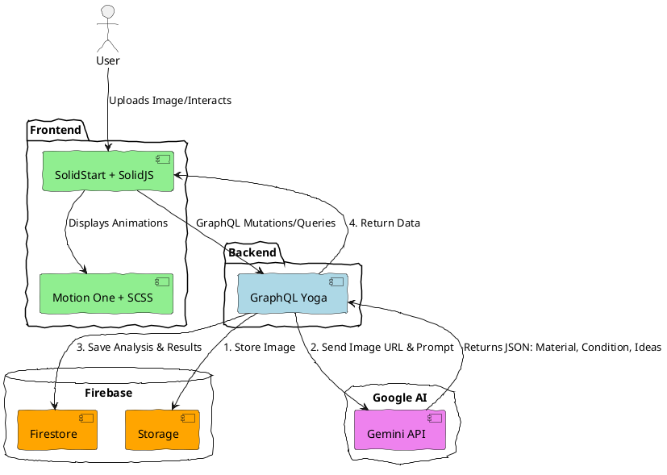
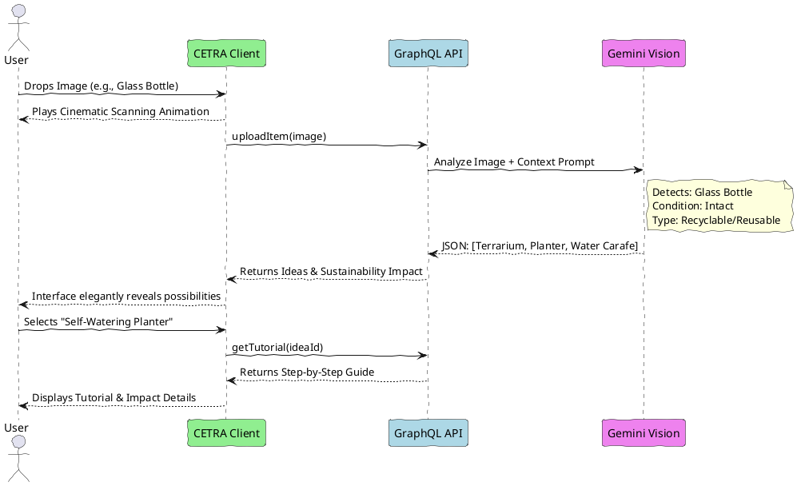

# CETRA: Vision Document

## The Core Philosophy

**"Not everything discarded has lost its value."**

In a world overwhelmed by waste, we often throw things away not because they are useless, but because we lack the imagination to see what they could become. **CETRA** is an AI-powered sustainability companion that bridges this imagination gap. It gives you a "second sight"—the ability to look at an empty jar, a piece of cardboard, or leftover food, and instantly see its hidden potential.

This isn't a guilt-driven recycling app. It's a magical, creative, and futuristic tool that turns sustainability into an act of discovery.

## The Target Audience

- **The Eco-Curious**: People who want to reduce waste but don't know how or lack the time to research.
- **The DIY Enthusiast**: Crafters and makers looking for inspiration and upcycling projects.
- **The Thrifty & Practical**: Individuals looking to save money by reusing what they already have.
- **Design Admirers**: Users who appreciate premium, cinematic, and emotionally resonant software experiences.

## The Aesthetic Vision

We are building a product that feels like a glimpse into a sustainable future. The visual language draws inspiration from Apple, Linear, Cosmos, and Nothing OS.

- **Cinematic Lighting**: Soft, atmospheric glowing effects (specifically "emerald eco glow") that make the interface feel alive.
- **Glassmorphism**: Translucent, floating cards that create depth and a sense of premium quality.
- **Fluid Motion**: Silky smooth transitions, AI scanning animations, and micro-interactions that make every action feel responsive and magical.
- **Minimalist Elegance**: High-contrast, clean typography, and generous spacing. No cluttered tables, no enterprise-style dashboards—just pure, immersive storytelling.

## The Core Experience (The "Magical Flow")

The entire application is built around one mesmerizing interaction:

1. **The Scan**: The user drops an image of an object (e.g., a glass bottle) onto the interface.
2. **The Understanding**: An immersive scanning animation plays. The AI instantly identifies the material, its condition, and its properties.
3. **The Reveal**: The interface elegantly transitions to reveal possibilities. The bottle isn't trash; it's a "Self-Watering Planter," a "Terrarium," or an "Aesthetic Water Carafe."
4. **The Action**: The user is presented with generated, step-by-step DIY tutorials, difficulty estimations, and the quantifiable sustainability impact (e.g., "$15 saved, 1kg CO2 prevented").
5. **The Community**: The user saves the idea or publishes their own transformation, inspiring others.

## Technical Foundations

To deliver this magical experience, the architecture must be fast, modern, and robust:

- **Frontend**: SolidStart & SolidJS for lightning-fast reactivity, combined with Motion One for cinematic animations. Modular SCSS ensures bespoke, high-performance styling without generic utility classes.
- **AI Engine**: Google Gemini API & Gemini Vision power the core intelligence—delivering instant object recognition, creative reasoning, and structured data generation.
- **Backend & Data**: GraphQL Yoga provides a flexible data layer, while Firebase Firestore & Storage handle real-time data and media seamlessly.

### System Architecture Diagram

### The Magical User Flow

## The Emotional Impact

CETRA is designed to evoke a specific feeling: **Awe**.

When a user sees a forgotten piece of cardboard instantly reimagined into a beautiful desk organizer, they shouldn't just feel informed—they should feel inspired. By pairing cutting-edge AI with a breathtaking UI, CETRA shifts the narrative of sustainability from a _chore_ to an _opportunity_.

It proves that with a little AI-assisted imagination, nothing is truly waste.
